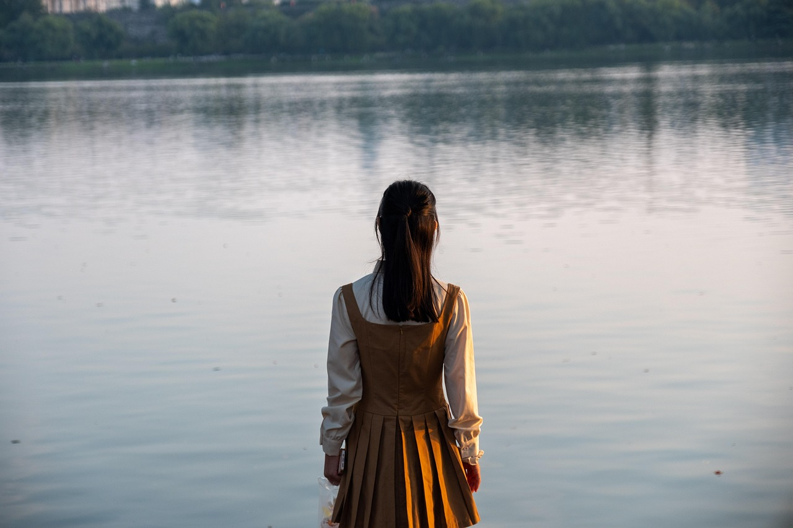

# sunglass-cli

## Image Color Palette Converter

This Python script converts an input image to a specified color palette. The script utilizes the CIEDE2000 color difference algorithm to find the closest matching colors in the given palette.

### Usage:
1. Install the required Python libraries:
   ```
   docker run --rm -it --name python -v .:/src python:3.10 bash
   pip install pillow==10.0.1 colormath==3.0.0 numpy==1.22.0
   ```

2. Run the script with the following command-line arguments:
   ```
   python image_color_converter.py input_image_path output_image_path --palette color1 color2 color3 ... --color-space rgb/hsv/hsl
   ```
   - `input_image_path`: Path to the input image.
   - `output_image_path`: Path to save the output image.
   - `--palette`: List of hex colors to use in the output image (optional).

### Example:
```
python /src/sunglass.py input.jpg output.jpg --palette ffffff 999999 555555 222222
python /src/sunglass.py /src/res/input.jpg /src/res/output.jpg
```

### Results:




Feel free to contribute, report issues, or suggest improvements!